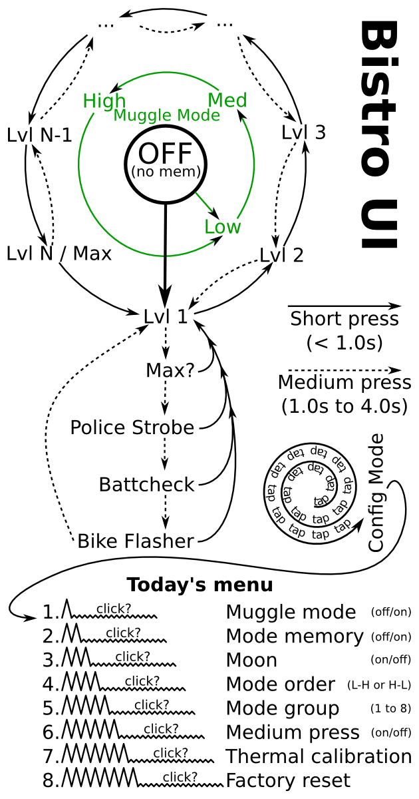
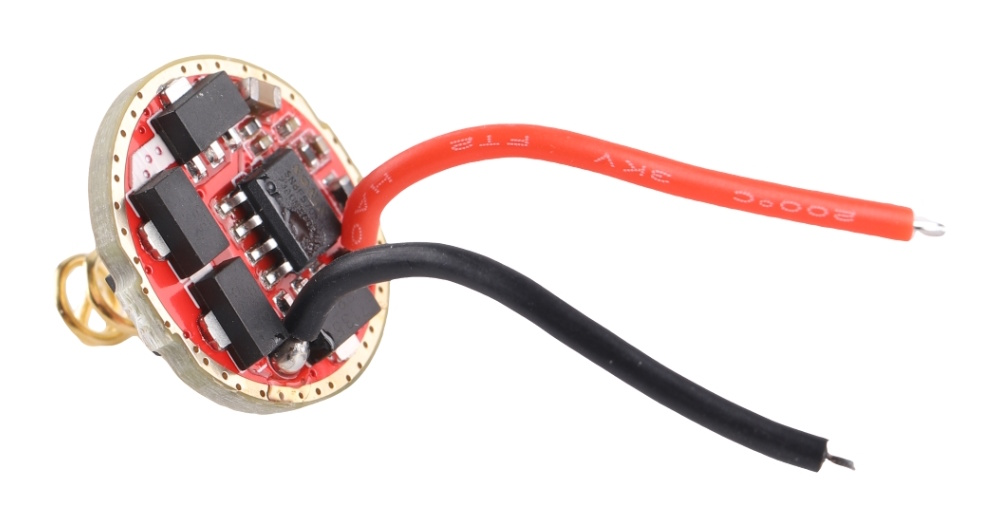
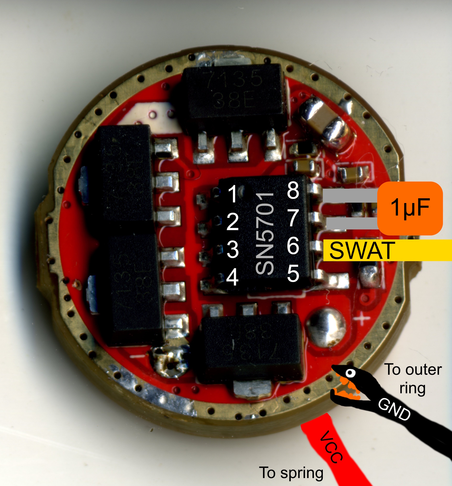
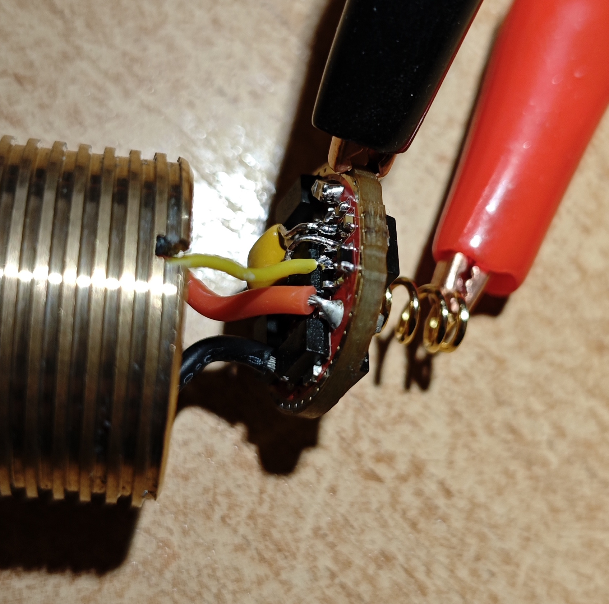

# BistroSN

A port of the [Bistro flashlight firmware](https://github.com/ToyKeeper/flashlight-firmware/tree/trunk/ToyKeeper/bistro) to [Convoy SN8F5701 8x7135 driver](https://convoylight.com/products/17mm-7135-8-driver-12groups-3040ma).

## Disclaimer

This is an experimental port to prove that custom firmware for Sonix-based flashlight drivers is possible. Most of the original code is left as-is, with ATtiny-specific bits rewritten into Sonix-specific bits. Everything seems to work, but there might be nasty bugs, so be careful!

Also note that once you flash this firmware, there is no going back: the stock firmware in Convoy drivers is read-protected, so there is no way to back it up.

## Features

Supports all the features from the original Bistro firmware:

- Short press to switch modes forward
- Medium press to switch modes backward (optional)
    - Requires an extra capacitor on the driver
- Configurable mode memory
- Configurable mode groups
- Thermal protection
    - Manual calibration is not required (but is possible)
- Low voltage protection

## User interface

<p></p>

## Supported driver types

At the moment, a single driver type is supported: the Convoy 8x7135 driver with SN8F5701 microcontroller. This is the kind of driver you get if you order [Convoy S2+](https://convoylight.com/products/convoy-s2-black-18650-flashlight) or [Convoy S3](https://convoylight.com/products/convoy-s3-black-18650-flashlight) with SST20, XPL HI or 219 LED. It is also available as a [separate purchase](https://convoylight.com/products/17mm-7135-8-driver-12groups-3040ma).

<p></p>

If you're buying a new flashlight to try this firmware, I recommend the Convoy S3, as the driver in the Convoy S2+ will likely be soldered to the pill, complicating disassembly.

## Installation steps

### Required hardware

You need programmer hardware to flash this firmware. There are two options:

1. The official [Sonix SN-Link V3](https://www.sonix.com.tw/article-en-1018-22255) programmer (retails for around $50 on AliExpress).
2. The unofficial [SN8Flash](https://github.com/silicagel777/SN8Flash) utility paired with a $2 USB-UART dongle, a resistor, and a transistor.

The second option is much cheaper, so this guide assumes you're going to use SN8Flash. Follow the [SN8Flash documentation](https://github.com/silicagel777/SN8Flash#required-hardware) for detailed hardware requirements.

You'll also need a soldering iron, a few wires, crocodile clips and (optionally) a 1uF capacitor for medium press function.

### Hardware connections

1. Take apart your flashlight and get to the driver.
2. Solder a wire to pin 6 of SN8F5701: it goes to SWAT pin of the programmer.
3. Solder a 1uF capacitor between pins 7 and 8 of SN8F5701.
    - This is an optional step to support medium press. The existing 0.1uF capacitor on the driver is not enough to distinguish between medium and long press.
    - A 0603 capacitor should fit between the pins nicely. Or you can use a through-hole one and form its legs accordingly.
4. Connect a crocodile clip to the driver outer ring: it goes to GND pin of the programmer.
5. Connect a crocodile clip to the driver spring: it goes to VCC pin of the programmer.

Here are a few hopefully helpful pictures:

<p>
    <a href="docs/driver-connection-diagram.jpg"></a>
    <a href="docs/driver-connection-photo.jpg"></a>
</p>

### Firmware flashing

Grab a HEX file from the [Releases](https://github.com/silicagel777/bistro-sn/releases) section:
- Use `bistro_sn8f5701_convoy_7135.hex` if you added the 1uF capacitor.
- Use `bistro_sn8f5701_convoy_7135_nocap.hex` if you did not add the capacitor. Medium press is not available in this build, and short/long press threshold is calibrated for smaller capacitance.

Then, flash the file using the following SN8Flash command:

```
sn8flash --port <PORT> write --file <FILE_NAME>
```

Notes:

- If the directory of `sn8flash` is not in your PATH environment variable, replace `sn8flash` with full or relative path to the tool
- Replace `<PORT>` with programmer serial port. Port name is going to be something like `COM7` for Windows or something like `/dev/ttyACM0` for Linux.
- Replace `<FILE_NAME>` with full or relative path to the HEX file.

Example:
```
.\sn8flash.exe --port COM7 write --file .\bistro_sn8f5701_convoy_7135.hex
```

Done! You can now detach the crocodile clips, desolder the SWAT wire, and reassemble the flashlight.

## Firmware development

To compile this firmware, you'll need the following tools:

- SDCC compiler:
    - Windows: [use the official installer](https://sdcc.sourceforge.net/index.php#Download).
    - Linux: install from your package manager, e.g. `apt update && apt install sdcc`
- Make:
    - Windows: download [build tools from xPack](https://github.com/xpack-dev-tools/windows-build-tools-xpack/releases), extract, and add the `bin` directory to your `PATH` environment variable.
    - Linux: install from your package manager, e.g. `apt update && apt install make`

Once all the tools are installed, use the following commands:

- `make` to compile for a driver with 1uF capacitor
- `make LAYOUT=CONVOY_7135_NOCAP` to compile for a driver without 1uF capacitor (medium press is not available)
- `make clean` to remove compiled files
- `make flash PORT=<YOUR_SERIAL_PORT>` to flash with SN8Flash

If you use Visual Studio Code, you can also copy editor configuration files from `.vscode-samples` to `.vscode` and adapt them to your liking.
